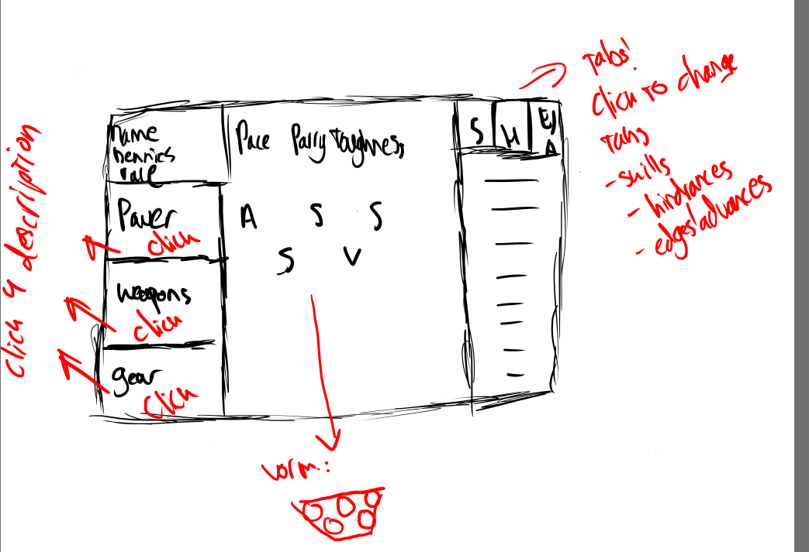

# Codex

## In het kort

Codex een (WIP) Programma voor het bijhouden van characters
voor het Savage Worlds: Adventure Edition (SWADE). Het programma
is nog niet voltooid, maar heeft als doel om niet alleen de
characters zelf, maar ook dingen als, races, edges, hinrances,
gear, armour en powers. Het programma kan, in theorie, contoleren
of aanpassingen aan een character binnen de regels/vereisten van
die aanpassing passen, of statestieken die afgeleid zijn van
door spelers bepaalde waarden berekenen.

Op het moment is maar een deel van deze fuctionaliteit geimplementeed,
de backend is, met uitzondering van de gear, armour en powers, min of
meer af. Natuurlijk zullen er dingen zijn die nog wat werk nodig hebben,
en dingen zoals getters en setters ontbreken omdat pas toegevoegd worden
als ze nodig zijn.

## Design

#### Frontend

#### Backend

Deze afbeeldingen geven een mooie inkijk in het design van de 
frontent als de backend, en de verschillen tussen de processen.
Beide processen hebben als uiteindelijke doel om een idee naar 
code te vertalen, dat kan een tekening zijn van hoe een ui er 
uit moet komen te zien, of de toch comprexe relaties tusses 
verschillende onderdelen van een character.
